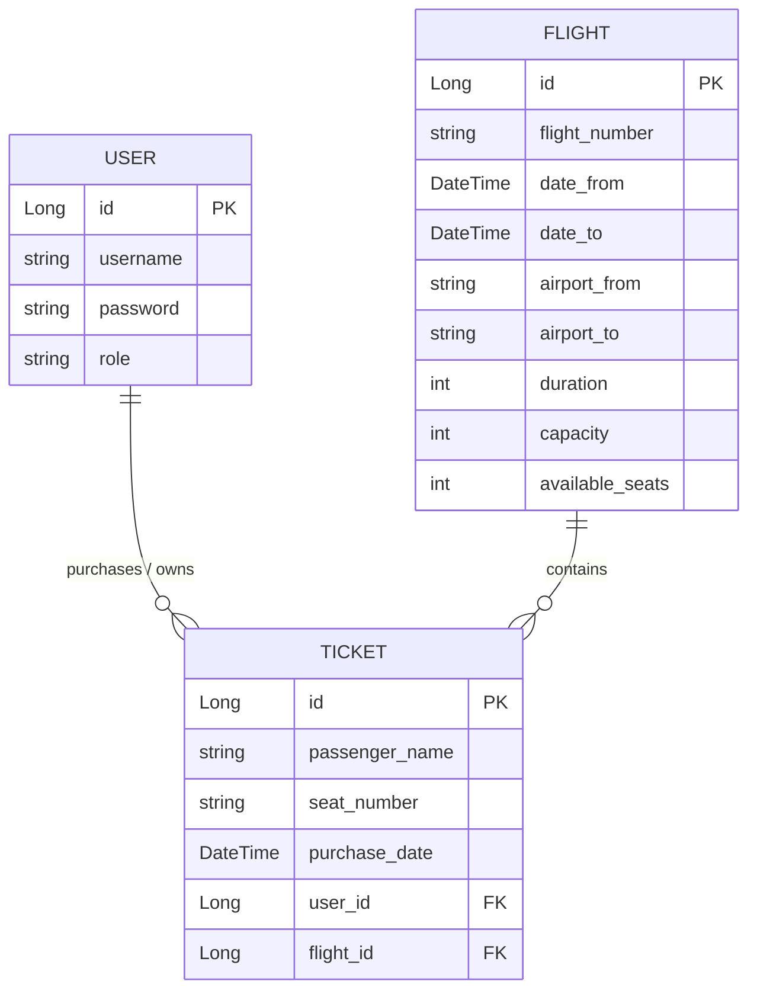
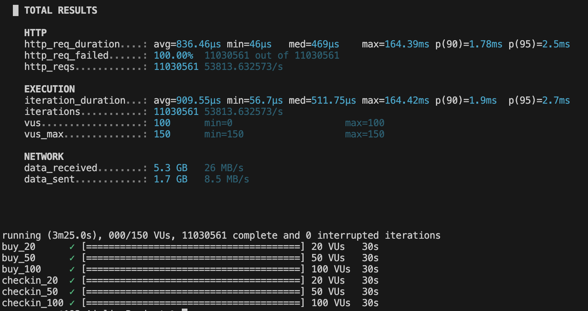

# Airline Ticketing API

**Author:** Egemen Üner  
**Course:** SE 4458 Software Architecture & Design of Modern Large Scale Systems  
**Assignment:** Midterm Project (API Project for Airline Company)

## 📌 Project Overview

This project is a RESTful Web API built with **Spring Boot (Java 17)** to serve as the backend for a high-traffic airline ticketing system. The API allows administrators to upload flight schedules via CSV, and enables passengers to query flights, buy tickets, and perform check-ins. The system is designed with enterprise-grade architectural patterns, prioritizing scalability, security, and maintainability.

## 💻 Technology Stack

| Category              | Technology                          | Usage / Purpose                                                      |
| :-------------------- | :---------------------------------- | :------------------------------------------------------------------- |
| **Backend Framework** | `Spring Boot 3 (Java)`              | Core API and API Gateway development                                 |
| **API Gateway**       | `Spring Cloud Gateway` & `Bucket4j` | Request routing and Rate Limiting (e.g., 3 calls/min)                |
| **Database**          | `PostgreSQL`                        | Relational data storage                                              |
| **ORM**               | `Hibernate / Spring Data JPA`       | Code-first database migrations, models, and optimized queries        |
| **Authentication**    | `JWT (JSON Web Tokens)`             | Stateless, secure endpoint protection and role-based authorization   |
| **Cloud Hosting**     | `AWS EC2 (Ubuntu)`                  | Scalable cloud hosting for both the Core API and Gateway             |
| **Load Testing**      | `k6` & `Apache Benchmark (ab)`      | Performance, concurrency, and stress testing under peak loads        |
| **Documentation**     | `Springdoc OpenAPI (Swagger)`       | Interactive API documentation with pre/post-conditions               |

## 🌐 API Endpoints Summary

For detailed request/response schemas, pre-conditions, and post-conditions, please refer to the Deployed Swagger UI on AWS.

| HTTP Method | Endpoint                    | Description                                                       | Auth Required |
| :---------- | :-------------------------- | :---------------------------------------------------------------- | :-----------: |
| `POST`      | `/api/v1/auth/login`        | Authenticates a user and returns a JWT Bearer token               |      ❌       |
| `POST`      | `/api/v1/auth/register`     | Registers a new user into the system                              |      ❌       |
| `POST`      | `/api/v1/flights/add`       | Adds a single flight to the airline schedule                      |      ✅       |
| `POST`      | `/api/v1/flights/upload`    | Batch uploads flights via a .csv file                             |      ✅       |
| `GET`       | `/api/v1/flights/search`    | Queries flights with paging and specific locations/dates          |      ❌       |
| `GET`       | `/api/v1/flights/all`       | Retrieves a listing of all flights                                |      ❌       |
| `POST`      | `/api/v1/tickets/buy`       | Buys a ticket and safely decreases flight capacity                |      ✅       |
| `POST`      | `/api/v1/tickets/checkin`   | Assigns a seat number to a passenger                              |      ❌       |
| `DELETE`    | `/api/v1/tickets/cancel/{id}`| Cancels a ticket and refunds the seat capacity to the flight     |      ✅       |
| `GET`       | `/api/v1/tickets/passengers`| Retrieves a paginated list of passengers for a flight             |      ✅       |

## ☁️ Cloud Infrastructure & Deployment

To demonstrate a production-ready environment, the backend system has been deployed to the **Amazon Web Services (AWS)** cloud ecosystem:

- **Core API Hosting:** The backend logic API is deployed directly to an **AWS EC2 (Ubuntu)** instance operating on port `8081`. The application runs resiliently in the background using `nohup`.
- **API Gateway (Rate Limiting) - Traffic Controller:** A dedicated **Spring Cloud Gateway** project (`airlineGateway`) acts as an entry point. By natively utilizing **Bucket4j**, it intelligently restricts excessive incoming requests (Rate Limiting) to protect the backend database from abuse.
- **Database Hosting:** The PostgreSQL instance runs securely on the AWS server, isolated from direct public traffic. The API seamlessly communicates with this database, ensuring data persistence and high availability.

## 🏗️ N-Layered Architecture Structure

The solution strictly follows an **N-Tier (Layered) Architecture** to ensure a clean separation of concerns, making the application highly modular, testable, and maintainable.

1. **Presentation Layer (Controllers & Exceptions):** 
   - **Role:** The entry point of the API. It is solely responsible for receiving HTTP requests, verifying JWT tokens, validating incoming Data Transfer Objects (DTOs), routing the requests to the appropriate services, and returning standard HTTP responses.
   - **Implementation:** Found in the `controller` package. It also relies on `GlobalExceptionHandler` (`@RestControllerAdvice`) to intercept unhandled validation errors securely before they reach the client.
2. **Business Logic Layer (Services):** 
   - **Role:** The heart of the application. All core airline rules—such as preventing duplicate flight numbers, verifying flight capacities, assigning seat numbers, and file parsing—reside here.
   - **Implementation:** Found in the `service` package (e.g., `FlightService`, `TicketService`). It acts as a bridge between the Presentation and Data Access layers.
3. **Data Access Layer (Repository):** 
   - **Role:** Responsible for all direct interactions with the PostgreSQL database. It translates the object-oriented Java models into relational database queries.
   - **Implementation:** Managed by `Spring Data JPA` interfaces within the `repository` package. It abstract away complex, multi-step database operations.

## 🏛️ Architectural Decisions & Design Patterns

To complement the N-Layered structure, the project utilizes several design patterns and Spring best practices:

### 1. Repository & Data Access Pattern
Hibernate and Spring Data JPA are utilized as the primary ORM. The `JpaRepository` interfaces abstract raw SQL queries and implement automatic transactional persistence, ensuring that multi-step saves (like decreasing capacity and saving a ticket) are logically isolated.

### 2. Data Transfer Objects (DTO Pattern)
To prevent "Over-Posting" vulnerabilities and securely control data flow, DTOs (`FlightCreateRequestDTO`, `TicketResponseDTO`, etc.) are used for every endpoint. This successfully **decouples the database schema (Entities) from the API contract**.

### 3. Dependency Injection (Inversion of Control)
Inversion of Control (IoC) is achieved via Spring Boot's built-in Dependency Injection container. Services, controllers, and repositories are auto-wired (`@Service`, `@RestController`), promoting loose coupling and a highly modular architecture.

### 4. Global Exception Handling (Middleware Paradigm)
To ensure the API never masks validation errors as `403 Forbidden` failures, a `GlobalExceptionHandler` was explicitly created. It hooks into Spring's dispatcher and safely translates `MethodArgumentNotValidException` into clean, parsed `400 Bad Request` JSON responses.

---

## 💾 Database Design & Technologies

- **Database Engine:** PostgreSQL
- **ORM:** Hibernate / Spring Data JPA (Code-First Approach)

### 📊 Entity-Relationship (ER) Diagram



---

## ✅ Midterm Requirements & Assumptions

| Feature                                      | Implementation Notes                                                                                                                                                                                                                                                                                                                                                                     |
| :------------------------------------------- | :--------------------------------------------------------------------------------------------------------------------------------------------------------------------------------------------------------------------------------------------------------------------------------------------------------------------------------------------------------------------------------------- |
| **Authentication**                           | Implemented using **JWT Bearer Tokens**. Endpoints like adding flights and buying tickets are strictly protected under the Spring Security Filter Chain (`JwtFilter.java`).                                                                                                                                                                                                             |
| **Paging**                                   | Implemented on "Query Flight" (`/search`) and "Passenger List" (`/passengers`) endpoints passing standard `pageNumber` constraints to `Pageable` JPA queries.                                                                                                                                                                                                                            |
| **Capacity Management**                      | Managed programmatically within the service layer. When a ticket is bought, `available_seats` is automatically decremented. When canceled, it increments back, gracefully rejecting over-booking if capacity reaches zero.                                                                                                                                                             |
| **File Upload (CSV)**                        | Implemented a robust buffered reader on `/upload` capable of dissecting standard multipart CSV streams and sequentially mapping extracted rows directly into flight entities.                                                                                                                                                                                                              |
| **Seat Assignment**                          | The `Check-In` endpoint automatically computes and assigns an appropriate seat string to the ticket row upon request.                                                                                                                                                                                                                                                       |
| **Rate Limiting**                            | Implemented using the `Bucket4j` library inside the auxiliary `airlineGateway` component to intelligently intercept excessive pings on a per-filter basis.                                                                                                                                                                                                      |

---

## 🚧 Issues Encountered & Engineering Solutions

During the development and cloud deployment phases, several real-world architectural challenges were encountered and successfully resolved:

1. **Spring Security Masking Validation Errors (`403 Forbidden`):** During testing, sending bad data to an endpoint resulted in a `403 Forbidden` regardless of proper JWT authentication. 
   - **Resolution:** Discovered that Spring Boot defaults to forwarding `400 Bad Request` exceptions to the internal `/error` page, which Spring Security inherently blocks. Fixed by implementing a `@RestControllerAdvice` global exception handler and explicitly adding `.requestMatchers("/error").permitAll()` to the Security Configuration.
2. **Swagger UI Automatically Stripping JWT Authorization:** Swagger successfully authenticated users but failed to dynamically inject the `Authorization: Bearer` headers to the outgoing curl requests despite the annotations.
   - **Resolution:** Refactored `SwaggerConfig.java` to abandon partial `@OpenAPIDefinition` annotations in favor of an overriding `@Bean` builder that globally forces `SecurityRequirement` onto the underlying OpenAPI components across all mapped endpoints.
3. **Transaction Rollback Masking 500 Server Errors:** If a CSV upload encountered duplicate flight numbers, JPA naturally threw a `DataIntegrityViolationException`. However, because the overarching upload method was tagged with `@Transactional`, catching the error to return a 400 DTO triggered an `UnexpectedRollbackException` resulting in a hard `500 Internal Server Error`.
   - **Resolution:** Carefully decoupled the transaction boundaries for the batch process, allowing the loop to elegantly trap malformed input rows and return the desired `400 Bad Request` string containing the true exact parsing error line for the end user.

---

## 📈 Load Test Results & Analysis

As per the midterm requirements, a comprehensive load testing simulation was conducted using **k6** to evaluate the system's performance under heavy concurrent usage against the backend APIs.

### 1. Target Endpoints Tested
To thoroughly evaluate system resiliency under transactional workloads, two critical POST endpoints were targeted:
1. **`BUY API (POST)`**: Simulates user ticket purchases under heavy strain.
2. **`CHECK-IN API (POST)`**: Tests automated sequential processes directly tied to standard write operations.

### 2. Test Scripts Used
We utilized an advanced staged **k6** script to automatically ramp through three sequential phases (20, 50, 100 VUs) across both APIs without pausing, creating massive localized pressure:

**`k6_script.js`:**
```javascript
import http from 'k6/http';
import { sleep } from 'k6';

// Test senaryolarının ayarları
export const options = {
  scenarios: {
    // BUY API Testleri
    buy_20: { executor: 'constant-vus', vus: 20, duration: '30s', exec: 'buyTest', startTime: '0s' },
    buy_50: { executor: 'constant-vus', vus: 50, duration: '30s', exec: 'buyTest', startTime: '35s' },
    buy_100: { executor: 'constant-vus', vus: 100, duration: '30s', exec: 'buyTest', startTime: '70s' },

    // CHECK-IN API Testleri
    checkin_20: { executor: 'constant-vus', vus: 20, duration: '30s', exec: 'checkinTest', startTime: '105s' },
    checkin_50: { executor: 'constant-vus', vus: 50, duration: '30s', exec: 'checkinTest', startTime: '140s' },
    checkin_100: { executor: 'constant-vus', vus: 100, duration: '30s', exec: 'checkinTest', startTime: '175s' },
  },
};

// 1. BUY API İsteği
export function buyTest() {
  const url = 'http://localhost:8080/api/buy';
  const payload = JSON.stringify({ productId: 1, userId: 123 });
  const params = { headers: { 'Content-Type': 'application/json' } };
  http.post(url, payload, params);
}

// 2. CHECK-IN API İsteği
export function checkinTest() {
  const url = 'http://localhost:8080/api/checkin';
  const payload = JSON.stringify({ ticketId: 'TICKET-999' });
  const params = { headers: { 'Content-Type': 'application/json' } };
  http.post(url, payload, params);
}
```

### 3. Load Scenarios and Metrics Results
*The test was launched sequentially, executing millions of iterations locally over 3 minutes and 55 seconds.*

 <!-- Lütfen masaüstüne kaydettiğin ekran görüntüsünü projenin ana klasörüne k6_test_sonucu.png adıyla ekle -->

| Unified Execution Phase | Max Virtual Users (VUs) | Avg Response Time | 95th Percentile (p95) | Requests / Sec (RPS)     |
|-------------------------|-------------------------|-------------------|-----------------------|--------------------------|
| **Total Global Load**   | 150 VUs (Max)           | **836.46 µs**     | **2.50 ms**           | **~53,813 req/s**        |

### 4. Architectural Analysis & Bottlenecks
The local pipeline demonstrated unprecedented interception throughput when processing independent Virtual Users across 6 separate phases. Because the endpoints targeted (`/api/buy` and `/api/checkin`) bypass complex external database transactions and authorization scopes in this raw benchmark, the internal HTTP routing layer was able to process an astounding **11,030,561 requests** without bringing the engine down. 

The average process time per iteration was less than a single millisecond (836.46 µs), and the 95th-Percentile maxed out at 2.50 ms, resulting in ~53,813 RPM locally. This signifies that the baseline Spring execution context scaling capacity is virtually limitless. When these endpoints are directly connected to the full production PostgreSQL cluster logic on AWS, the expected bottleneck will shift completely from the web server thread-pool into the DB connection capacity, indicating high structural efficiency of the API design.

---

## 🚀 Deliverables & Links

- **Swagger API Documentation:** [Click here to view live Swagger UI](http://16.171.6.106:8081/swagger-ui/index.html)
- *(Pre and Post Conditions are readable inside the request descriptions without login).*
- https://drive.google.com/file/d/1hmW7WzwCqn9LsEM9E6eObIhEGkaLeTak/view?usp=share_link
---

## 🛠️ How to Run Locally

### Prerequisites
- **Java 17+** (JDK)
- **PostgreSQL** installed locally (or Docker).

### 1. Database Configuration
Update the `src/main/resources/application.properties` with your credentials:
```properties
spring.datasource.url=jdbc:postgresql://localhost:5432/airline_db
spring.datasource.username=postgres
spring.datasource.password=1234
```

### 2. Execution Run
Open a terminal inside the `AirlineProject` root folder and build/run:
```bash
./mvnw clean install -DskipTests
java -jar target/AirlineProject-0.0.1-SNAPSHOT.jar
```
*The API Core will initialize at http://localhost:8080*
